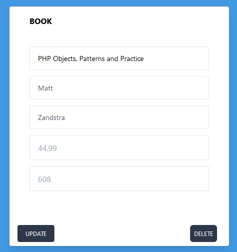

<<<<<<< HEAD

## About Laravel

Laravel is a web application framework with expressive, elegant syntax. We believe development must be an enjoyable and creative experience to be truly fulfilling. Laravel takes the pain out of development by easing common tasks used in many web projects, such as:

- [Simple, fast routing engine](https://laravel.com/docs/routing).
- [Powerful dependency injection container](https://laravel.com/docs/container).
- Multiple back-ends for [session](https://laravel.com/docs/session) and [cache](https://laravel.com/docs/cache) storage.
- Expressive, intuitive [database ORM](https://laravel.com/docs/eloquent).
- Database agnostic [schema migrations](https://laravel.com/docs/migrations).
- [Robust background job processing](https://laravel.com/docs/queues).
- [Real-time event broadcasting](https://laravel.com/docs/broadcasting).

Laravel is accessible, powerful, and provides tools required for large, robust applications.

## Learning Laravel

Laravel has the most extensive and thorough [documentation](https://laravel.com/docs) and video tutorial library of all modern web application frameworks, making it a breeze to get started with the framework.

You may also try the [Laravel Bootcamp](https://bootcamp.laravel.com), where you will be guided through building a modern Laravel application from scratch.

If you don't feel like reading, [Laracasts](https://laracasts.com) can help. Laracasts contains over 2000 video tutorials on a range of topics including Laravel, modern PHP, unit testing, and JavaScript. Boost your skills by digging into our comprehensive video library.

## Laravel Sponsors

We would like to extend our thanks to the following sponsors for funding Laravel development. If you are interested in becoming a sponsor, please visit the Laravel [Patreon page](https://patreon.com/taylorotwell).

### Premium Partners

- **[Vehikl](https://vehikl.com/)**
- **[Tighten Co.](https://tighten.co)**
- **[Kirschbaum Development Group](https://kirschbaumdevelopment.com)**
- **[64 Robots](https://64robots.com)**
- **[Cubet Techno Labs](https://cubettech.com)**
- **[Cyber-Duck](https://cyber-duck.co.uk)**
- **[Many](https://www.many.co.uk)**
- **[Webdock, Fast VPS Hosting](https://www.webdock.io/en)**
- **[DevSquad](https://devsquad.com)**
- **[Curotec](https://www.curotec.com/services/technologies/laravel/)**
- **[OP.GG](https://op.gg)**
- **[WebReinvent](https://webreinvent.com/?utm_source=laravel&utm_medium=github&utm_campaign=patreon-sponsors)**
- **[Lendio](https://lendio.com)**

## Contributing

Thank you for considering contributing to the Laravel framework! The contribution guide can be found in the [Laravel documentation](https://laravel.com/docs/contributions).

## Code of Conduct

In order to ensure that the Laravel community is welcoming to all, please review and abide by the [Code of Conduct](https://laravel.com/docs/contributions#code-of-conduct).

## Security Vulnerabilities

If you discover a security vulnerability within Laravel, please send an e-mail to Taylor Otwell via [taylor@laravel.com](mailto:taylor@laravel.com). All security vulnerabilities will be promptly addressed.

## License

The Laravel framework is open-sourced software licensed under the [MIT license](https://opensource.org/licenses/MIT).
=======

# Component 2 - Task

This is an extension of Component 1 and using Laravel as a Framework for working with your views and data.

Data is again being stored as a json file and some of the previous PHP files are being used to read and update this 
data on the server side. The <b>JsonUtility</b> class has some additional methods in for amending this data on the server.
In the previous task you wrote HTML directly through the HTML writer class. In this exercise you are to work with Views 
in Laravel, and use appropriate Routes to call methods in a <b>ProductController</b> class

You are required to:

<ul>
<li>embed these files into a Laravel Project - the structure already used will map into Laravel.</li>
<li>create a front end (views) that will allow a user to perform CRUD operations</li>
<li>products should be displayed with a reusable template (i.e. card)</li>
<li>follow good practice and naming conventions for defining your routes, and methods in the controller</li>
</ul>

A javascript file has been provided which includes axios calls for performing asynchronous web requests. 
If using this then make note of the id and class selector names being used. Axios is a package which is included with 
Laravel.

## Sample Screens

An expected layout and structure could take the following form

## CREATE + READ

[IMAGE](readme_images/read.jpg)

Full Product Listing will include a blank template card at the end with POST (add button)

### UPDATE + DELETE

[IMAGE](readme_images/read.jpg)

A 'Selected' product will show a modified template with PATCH (update button) and DELETE (delete button) options

>>>>>>> 56d0e0a96363ff1c4254b093171d17aa322c8dbb
